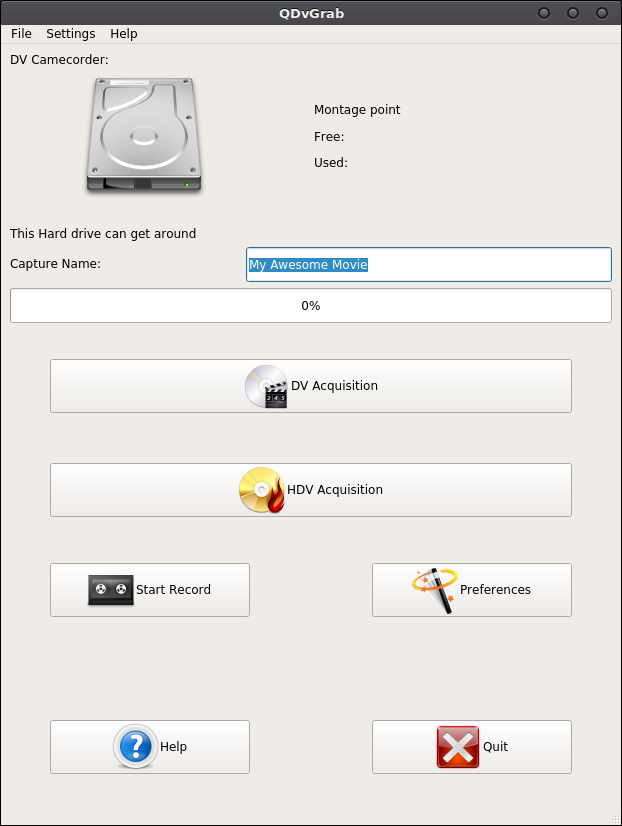
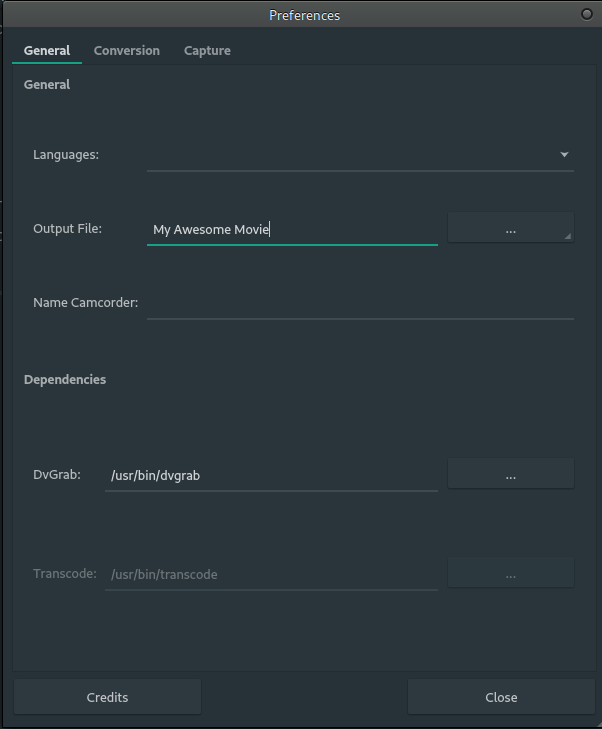
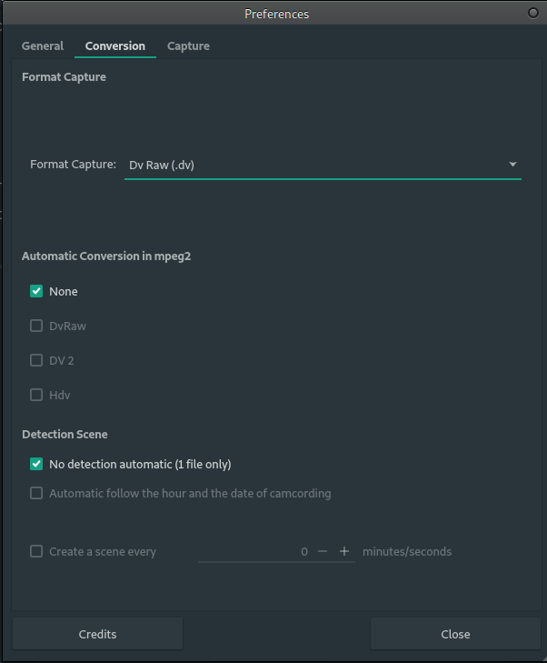
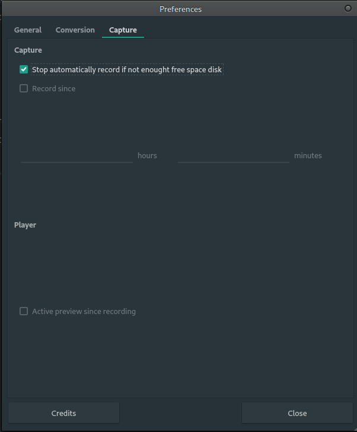

# QDvGrab

QDvGrab is a Gui in PyQt5 (using Python 3 and QT5 in backend) for dvgrab. The only main purpose is to grab your films from a DV or HDV Camcorder
 in an easy way.
 
About
-----

Simple Gui for dvgrab, QDvGrab is simple to use too. This is the main idea for this project i.e easy to install, easy to
 use. None command lines needs.
  
Features
--------

* Nice interface
* Simple utilisation
* Modern programm
* Complete Preferences
* Essential features of dvgrab
* No command lines for dvgrab

Screenshots
-----------

### QDvGrab

<p align="center">
    
</p>

### Preferences

<p align="center">
	
</p>

<p align="center">
	
</p>

<p align="center">
	
</p>


Dependencies
------------

* python 3
* pyqt5
* Qt5
* dvgrab

Installation
------------

For the moment, just open a console in the qdvgrab folder and type:

 ```
python qdvgrab.py
```

* Manjaro

    Like explained above, python3 is the default version so type :
    ```
    python qdvgrab.py
    ```
    
* Linux Mint/Ubuntu

    Works fine on this distribution but you must use at least Linux Mint 17 and Ubuntu 14.04. 
    Should be work on any previous version on which you can install Qt5, PyQt5 and Python3.
    However, the python default version is the version 2 and not the 3. So you should type :
    
    ```
    python3 qdvgrab.py
    ```
** For Ubuntu 20.04 and after
	Python3 is by default and shoud work fine just typing the following command (need to confirm) 
	```
	python qdvgrab.py
	```

